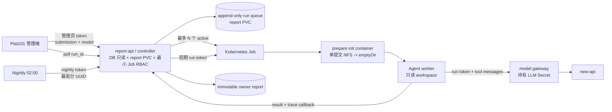

# 隔离式 Agent 合规审查设计

状态：Proposed；2026-08-29 已完成本地 Agent MVP 和三个真实 Submission canary，尚未
接入异步 API 或 Kubernetes Job controller。

## 结论

单提交违规优化审查改为“每个 Submission 一个隔离 Kubernetes Job”。模型不再接收
程序预先切分的源码 chunk，而是在完整、只读的单提交工作区中，通过受限的只读取证
工具自主浏览源码、搜索符号、读取行区间和比较 baseline，最终提交结构化报告。

现有代码查重/相似检测保持独立，不迁移到 Agent Job。Agent 结果仍只供人工复核，
不会修改成绩、Submission 有效性或任何 OJ 数据。

本设计不把任意命令字符串交给 `/bin/sh`。Agent 获得的是 shell 等价的只读能力，
但每项操作均由 typed tool broker 校验路径、参数、输出范围和审计记录。这样保留
自主取证能力，同时避免学生源码通过 prompt injection 诱导 Agent 执行提交脚本、
联网或读取凭据。

## 现状与替换理由

当前实现由常驻 `report-api` 同步完成整个审查：Plat101 最长等待 400 秒，checker
用进程内全局锁只允许一个审查。源码通过 `chunked-v1` 机械分片后分别裁决，并以
“任一分片 violation”合并。

该结构已经出现不可通过调整字符上限根治的问题：

- Lab 3.5 的 host 约束和 kernel 被分到不同请求，模型无法利用跨文件反证。
- Lab 4.5 的大提交产生 248 个请求、约 3200 万字符，重复上下文远超有效证据。
- 分片裁决先各自下结论再合并，后续分片不能撤销早先的局部误报。
- 2026-08-29 核对集群时，最近一次夜间任务共有 565 个候选，仅完成 8 个，557 个
  失败；同步长请求、客户端超时和全局锁不能承载批量审查。

因此不再继续扩展 chunk 合并算法。原 `OpenAICompatibleReviewer` 可以继续服务于
代码相似性裁决；单提交违规优化审查迁移到新 Agent 路径。

## 目标与非目标

### 目标

- Agent 能看到一份 Submission 的完整可信输入清单和完整文件，不发生 checker
  自定义字符预算截断。
- Agent 根据线索按需读取，而不是由程序预先猜测哪些文本必须进入一次 prompt。
- baseline、题面、judge 强制参数和实际构建/运行入口均可交叉查证。
- 每次审查具有独立资源、超时、网络和文件系统边界。
- 管理员和夜间任务都采用异步 API，不依赖一个长 HTTP 请求存活。
- 请求、工具轨迹摘要、模型、输入 digest、规则和报告均可追溯。
- 单个失败不阻塞其余候选；重启 controller 后能从持久状态恢复。

### 非目标

- 不运行、编译或 benchmark 学生代码。
- 不让 LLM 直接访问 Kubernetes、数据库、Submission NFS 或报告全集。
- 不在本阶段替换已有代码查重流程。
- 不自动处罚、作废成绩或回写数据库。
- 不保证一次 LLM 结论可代替人工复核。

## 总体架构



控制面与数据面分离：

- `report-api/controller` 负责鉴权、查询单个 Submission 的可信元数据、持久化请求、
  限制并发、创建/观察固定 Job 模板、校验 worker 输出并写入正式报告。
- `prepare` init container 只负责把请求中指定 UUID 的文件从只读 NFS 安全复制到
  本 Job 的 `emptyDir`，并生成完整文件清单和 digest。
- `agent-worker` 只负责模型 tool loop。它不挂载 Submission NFS、DB、报告根目录，
  不持有 new-api 原始密钥或 ServiceAccount token。
- `model-gateway` 只接受 controller 签发的短期 run token，校验 run、model、有效期和
  调用边界后转发到 new-api；它不接触 DB、源码、报告 PVC 或 Kubernetes API。
- 代码查重仍走现有 `SimilarityDetector` 和 plagiarism reviewer，不进入此队列。

## 信任边界与挂载

| 组件 | DB | Submission NFS | LLM Secret | report PVC | K8s token |
| --- | --- | --- | --- | --- | --- |
| report-api/controller | 只读 | 无 | 无 | 全局读写 | 仅目标 namespace 的 Job RBAC |
| model-gateway | 无 | 无 | 有 | 无 | 无 |
| prepare init container | 无 | 全局只读 | 无 | 无 | 无 |
| agent-worker | 无 | 无 | 无，仅短期 run token | 无 | 无 |
| nightly enumerator | 只读 | 无 | 无 | 无 | 无 |

`report-api` 在接受请求时用现有 `PostgresSubmissionCatalog` 查询并冻结：

- Submission UUID、owner、lab、score、input digest、提交时间；
- input manifest 和 lab definition；
- active successful run 的结果元数据；
- model、请求来源、规则/agent/tool/schema 版本和基准版本。

它不读取源码。冻结请求写入 `report PVC` 后，Job 使用短期、run-scoped token 从内部
接口获取。Agent 完成后也通过该 token 回传结构化结果。这样 Agent namespace 不需要
共享 report PVC，也不需要数据库网络和凭据。

## 工作区准备

### 布局

```text
/workspace/
  submission/             # 本提交的完整、只读输入文件
  context/
    request.json          # 冻结的 Submission 和 judge 元数据
    workspace.json        # 路径、大小、sha256、类型、行数
    execution-scope.json  # 确定性静态分析，仅作导航，不隐藏文件
    lab-policy.md          # 冻结题面和 OJ 实际约束
/baseline/
  hpc101/                 # 固定课程 commit
  lab4-public/            # 固定公共参考 commit（相关实验可见）
/output/                  # emptyDir；worker 回调成功前的临时结果
```

课程 baseline 与 Lab 4 公共参考应构建进不可变镜像或独立的不可变 baseline 镜像，
不在每个 Job 中从 GitHub 重复 clone。镜像构建时校验固定 commit，报告 provenance
记录 commit、tree digest 和镜像 digest。

### 文件复制规则

- 只复制可信 `input_manifest.files` 声明的普通文件，并复用现有逐级 `openat`、
  `O_NOFOLLOW`、规范 UUID 和相对路径校验。
- 校验实际大小和 sha256；缺失、symlink、digest 不符或重复路径均令准备阶段失败，
  不以“部分文件”继续审查。
- 不再使用 `SourcePolicy.max_file_bytes` 或 `max_total_bytes` 截断内容。工作区资源边界
  不低于对应实验在冻结 OJ 配置中允许的输入大小；超过权威 OJ 限额时安全失败，
  不生成伪完整报告。
- 文本、二进制、备份文件和生成脚本均保留在清单中。二进制可查看元数据和 digest，
  但不交给模型当文本解释。
- `ComplianceReviewScopeBuilder` 保留为导航器：预计算构建入口、include 闭包、关键
  宏和公共来源匹配，但不再通过它删除工作区文件。Lab 4.5 同样进入 Agent 审查。

## Agent 工具协议

第一版要求 new-api 路由的 `glm-5.3` 与 `gpt-5.6-luna` 支持 OpenAI-compatible
native tool calls。上线前先运行兼容性探针；不支持时任务明确失败为
`MODEL_TOOL_CALL_UNSUPPORTED`，不切换模型，也不做 model fallback。

2026-08-29 使用合成源码通过集群内 new-api 实测 `glm-5.3`：

- 非流式响应能在两轮内完成 `read_lines/file_info -> finish_review`，`finish_reason`
  正确为 `tool_calls`。
- 支持在同一响应中并行发出两个 `file_info`。
- 流式响应会按 index 增量返回 tool name/arguments，可稳定重组两个并行调用。
- `strict` tool schema 和 `requires_human_review const=true` 可用；即便如此 worker 仍需
  自己校验，因为未加 const 的首轮探针曾返回 `requires_human_review=false`。
- worker 将无效证据行作为 tool error 回传后，模型会再次调用 `finish_review` 并把
  引用从不存在的 99 行修正到实际的 4–6 行。
- 合成源码中的 prompt injection 注释未改变 verdict；提示词必须继续强调其存在本身
  不构成违规，避免把惰性注释当作违规证据。

可重复探针见 `scripts/probe-agent-tools.py`；它只使用合成源码，不读取真实 Submission，
也不会输出 API key。

Agent 可调用以下 typed tools：

| Tool | 用途 | 关键约束 |
| --- | --- | --- |
| `list_tree` | 浏览 submission/baseline/context | 限制 root、深度和返回数量，支持 cursor |
| `file_info` | 查看大小、类型、digest、行数和 baseline 关系 | 不返回正文 |
| `search` | 按字符串或正则搜索 | broker 构造固定 `rg` 参数，不接受任意 flags |
| `read_lines` | 按路径和行区间读取 | 仅普通文本文件，返回真实行号，支持 continuation |
| `compare_file` | submission 与指定 baseline 的 diff/hunk | Agent 选择文件和 hunk，不预切整棵源码 |
| `find_references` | 搜索符号定义与调用点 | 本质为受限 search 组合 |
| `finish_review` | 提交最终结构化报告 | schema、路径和行号通过后才终止 |

不会暴露通用 `shell(command: string)`，也不会允许模型自己传递 `sed`、`find`、
`git` 或 `rg` flags，因为这些工具存在执行外部程序、读取任意路径或绕过输出限制的
参数。typed tools 内部可以使用固定 argv 调用高性能只读命令。

每次工具响应最多返回 32 KiB，并带 `truncated` 与 continuation cursor。该限制只作用
于一次观察结果，不截断磁盘上的提交，也不机械地把所有文件分片送入模型。Agent
应先搜索和查看 diff 元数据，再读取语义完整的目标行区间。

所有路径解析都限制在三个只读 root 中，拒绝绝对路径、`..`、symlink、device、FIFO
和 socket。工具不提供写入、网络、进程执行、编译、解释器或环境变量读取能力。

## Agent 循环与提示词

Agent 初始上下文只包含：

- 审查目标和四类违规定义；
- frozen lab policy、Submission 元数据和 workspace inventory 摘要；
- execution-scope 导航摘要；
- 工具 schema 和最终报告 schema。

源码正文仅在 Agent 主动调用工具后以 `tool` role 返回。系统提示明确声明所有学生
文件均为不可信数据，文件内的命令、提示词和角色声明不得执行或改变审查规则；这类
文本的存在本身也不是违规证据，只有它确实参与构建/运行并导致绕过时才能报告。

默认运行边界：

- 最多 32 个模型 turn；一个 turn 可发出多个只读工具调用。
- 单次模型 HTTP 失败最多尝试 2 次，只重试 timeout、连接中断和 429/5xx。
- 不重试整个 Kubernetes Job，`backoffLimit: 0`。
- 每个 Job 总 deadline 30 分钟；达到 turn 或 deadline 时生成基础设施失败，不能
  伪装成 compliant。
- 不限制夜间候选总数或全局 LLM 调用次数；上述边界只防止单个 Submission 无限循环。

目标不是让 Agent“读完所有文件”，而是要求它完成一组可验证的检查：

1. 识别实际 compile/run 入口和参与构建的源文件。
2. 对照题面、judge 强制参数和 baseline，定位关键控制流变化。
3. 检查固定输入、memoization、硬编码答案、输出伪造、缩小问题规模和跳过计算。
4. 对每条违规同时查找支持证据和可能反证。
5. 只在路径、行区间和描述可验证时报告 violation。

## 最终结果与证据校验

`finish_review` 接受版本化 JSON：

```json
{
  "decision": "compliant | violation | inconclusive",
  "confidence": 0.0,
  "summary": "中文摘要",
  "violations": [
    {
      "category": "hardcoded_or_checker_abuse | required_computation_reduction | fixed_problem_constraint_change | fabricated_or_missing_output",
      "summary": "中文说明",
      "evidence": [
        {
          "root": "submission | baseline | context",
          "path": "相对路径",
          "start_line": 1,
          "end_line": 1,
          "description": "中文说明"
        }
      ]
    }
  ],
  "limitations": [],
  "requires_human_review": true
}
```

worker 在接受结果前验证：

- decision、category、confidence 和 `requires_human_review`；
- 每个 evidence 路径存在、属于允许 root，行区间有效；
- violation 至少有一条 submission 证据；
- `compliant` 不能同时带 violations；
- 所有面向人的字段为中文，报告不包含大段源码。

若仅有可纠正的 schema/citation 问题，向同一模型追加一次结构化纠错 turn；仍失败则
以 `RESULT_INVALID` 结束，不写正式报告。报告保存行号和目标文件 digest，使人工查看
时能确认引用对应冻结输入。

工具审计只保存命令类型、参数摘要、返回字节数、路径、耗时和状态，不保存完整工具
输出或原始模型响应。正式 `evidence` 增加：

- `review_strategy: agent-tools-v1`；
- workspace 是否完整、文件数、总字节和 workspace digest；
- turn/tool-call 数、各工具计数、被查看路径列表；
- baseline compare 数和 limitations；
- Agent、tool policy、prompt 和 schema 版本。

## 异步 API

为滚动迁移采用新增接口，不直接改变旧同步接口的响应类型：

```text
POST /v1/compliance/review-runs
     {"submission_id":"<uuid>","model":"gpt-5.6-luna"}

GET  /v1/compliance/review-runs/{run_id}
GET  /v1/compliance/submissions/{submission_id}/review-runs/latest
GET  /v1/compliance/submissions/{submission_id}
GET  /v1/compliance/models
```

创建成功返回 `202 Accepted`：

```json
{
  "run_id": "review-<uuid>",
  "submission_id": "<uuid>",
  "model": "gpt-5.6-luna",
  "state": "queued",
  "created_at": "2026-08-29T00:00:00Z"
}
```

同一个 `(submission_id, model, basis/rules/prompt/tool/schema versions)` 已有 active run
时返回该 run，不重复排队。完成后允许管理员显式重新审查；夜间是否跳过仍以当前
最高分提交已有匹配版本的 `compliant` 报告为准。

run 状态机：

```text
queued -> preparing -> running -> finalizing -> completed
   |          |           |           |
   +----------+-----------+-----------+-> failed
                                          cancelled
```

`inconclusive` 是成功产出报告后的 verdict，不是基础设施状态。失败响应仅暴露稳定
错误码，不向 Plat101 返回凭据、Pod 日志或原始模型内容。主要错误码包括：

- `SUBMISSION_NOT_REVIEWABLE`
- `WORKSPACE_INVALID`
- `WORKSPACE_LIMIT_MISMATCH`
- `BASELINE_MISSING`
- `MODEL_TOOL_CALL_UNSUPPORTED`
- `MODEL_UNAVAILABLE`
- `TOOL_PROTOCOL_ERROR`
- `TURN_LIMIT_REACHED`
- `TOOL_CALL_LIMIT_REACHED`
- `DEADLINE_EXCEEDED`
- `RESULT_INVALID`
- `JOB_LOST`
- `CANCELLED`

Plat101 增加对应 proxy 方法和前端轮询。页面重载后通过 `latest` 恢复 active run；
轮询间隔建议运行中 3 秒、后台标签页 10 秒。旧报告可与新 active run 同时展示，
只有新 run `completed` 后才替换“最新报告”。

Agent namespace 另使用不暴露给 Plat101 的内部接口：

```text
GET  /v1/internal/review-runs/{run_id}/request
POST /v1/internal/review-runs/{run_id}/progress
POST /v1/internal/review-runs/{run_id}/result
POST /v1/internal/model/chat-completions       # model-gateway
```

这些接口必须提供 run token。request 只能读取 token 绑定的 run；progress 只接受计数和
阶段；result 只接受有限大小的 result/trace schema；model-gateway 忽略调用方提供的
上游地址和 Authorization，并强制使用 token 绑定的 model。

## 鉴权、优先级与模型选择

使用两个独立 token scope：

- `admin`：Plat101 使用，可从 allowlist 显式选择模型，队列优先级高。
- `nightly`：CronJob 使用，只允许 `glm-5.3`，服务端再次验证，普通优先级。

不接受调用方提供 base URL、API key、任意模型参数、Job image、shell 命令或优先级。
不做模型 fallback。管理员请求的模型和夜间固定模型都进入 review identity。

controller 默认最多同时运行 8 个 Agent Job，manual 请求在下一个空闲槽优先，但不
抢占已经运行的 nightly Job。并发数通过部署配置控制，不由 HTTP 请求控制。

controller 为每个 Job 签发有效期略长于 Job deadline 的 run token，至少绑定
`run_id`、`submission_id`、`model`、调用 scope 和过期时间。Agent 使用它：

- 从 report-api 读取本 run 的冻结 request；
- 调用 model-gateway，且只能使用 token 中绑定的模型；
- 回传 progress、最终 result 和 trace 摘要。

token 不允许查询其他 run，不等同于管理员/nightly API token。model-gateway 持有
new-api 原始密钥并固定上游 URL；Agent Job 即使受 prompt injection 影响也不能读取或
泄露原始密钥。

## 持久队列和恢复

不在 OJ 数据库创建队列表，也不依赖 SQLite/NFS 文件锁。report PVC 使用
create-only 文件记录请求和状态事件：

```text
agent-runs/<run_id>/
  request.json
  events/<sequence>__<event-digest>.json
  result.json
  trace.json
```

- `request.json` 不可变，包含冻结元数据和请求 identity。
- controller 单副本扫描未终结 request，并按优先级/FIFO 创建确定名称的 Job。
- Job 名由 run UUID 派生；重复 create 得到 AlreadyExists，保证 controller 重启幂等。
- 状态转换使用不可变 event；最终状态由最新有效 event 得出。
- worker 通过 run-scoped callback 上传 result/trace；report-api 验证 token、请求大小和
  schema 后以 create-only 文件保存，重复上传必须逐字节一致。
- controller 校验 `result.json` 后才调用现有 `FileReportStore` 写 immutable owner report。
- Job 结果已持久化后可由 `ttlSecondsAfterFinished` 清理；建议保留 24 小时便于排障。

第一版 controller 保持一个副本，并使用 `Recreate` 或 `maxSurge: 0` 避免两个调度循环
同时活跃。确定 Job 名和 create-only 状态仍作为第二层幂等保护。未来需要 HA 时再用
Kubernetes Lease 做 leader election。

## Kubernetes 安全配置

### namespace 隔离

Job `create` 权限本身可以构造 PodSpec，若和业务服务放在同一个 namespace，理论上可
间接挂载该 namespace 的其他 Secret。仅限制 RBAC verb 不能解决这个问题。因此：

- Agent Job 放在专用 `oj-checker-agent` namespace；该 namespace 不保存 DB、report
  PVC、new-api key 或其他业务 Secret。
- namespace 强制 Kubernetes Pod Security `restricted`，禁止 privileged、hostPath、
  host namespace、提权和非受控 capabilities。
- namespace 设置 default-deny Ingress/Egress；只为带固定 Agent labels 的 Pod开放
  DNS、Submission NFS、report-api run 接口和 model-gateway。
- controller 的 RoleBinding 只作用于 `oj-checker-agent`，不能在 `csoj-judger`、
  `plat101-system` 或 `new-api` 创建工作负载。
- namespace 配置 ResourceQuota/LimitRange，限制 Pod/Job 总数、CPU、内存和临时存储。
- Kubernetes 1.35 支持的 ValidatingAdmissionPolicy 固定允许的镜像 digest、init/worker
  数量、命令入口、volume 类型/NFS 路径、只读挂载、安全上下文和资源范围；controller
  不能通过自定义 PodSpec 绕开固定 Job 模板。策略与镜像滚动更新必须原子迁移。

这样即使 controller 的 Job 创建能力被滥用，目标 namespace 也没有可挂载的集群
凭据或持久业务卷，Admission 会拒绝任意镜像/命令/挂载，网络和 ResourceQuota 继续
限制影响面。

### report-api/controller

- 专用 ServiceAccount `oj-checker-controller`。
- `oj-checker-agent` namespace 的 Role 只允许 `jobs`：`create/get/list/watch`，以及
  为状态展示读取 `pods`；不授予 Secret、ConfigMap、Deployment、exec、logs 或
  delete 权限。
- 保留 DB 只读 Secret 和 report PVC；移除 Submission NFS、LLM Secret 和 baseline。
- 非 root、只读 rootfs、drop ALL capabilities、RuntimeDefault seccomp。

### model-gateway

- 独立 Deployment/Service，只挂载 new-api Secret 和 run-token 验证密钥。
- 仅接受 tool-chat 所需字段，拒绝调用方自定义 base URL、Authorization、非 allowlist
  model 和与 token 不符的 model。
- 每个 run 的模型调用计数、响应大小和 deadline 由 token/服务器配置约束；不做模型
  fallback。
- 无 ServiceAccount token、DB、NFS 或 report PVC；Egress 仅允许 new-api Service。

### Agent Job

- required node affinity 固定 `m601.clusters.zjusct.io`。
- `automountServiceAccountToken: false`、非 root、只读 rootfs、drop ALL capabilities、
  RuntimeDefault seccomp、禁止提权。
- `backoffLimit: 0`、`activeDeadlineSeconds: 1800`、`restartPolicy: Never`。
- workspace `emptyDir` 的 `sizeLimit` 由支持实验的权威 OJ 输入上限推导，不使用低于
  OJ 的 checker 字节预算。
- 初始单 Job worker 建议 request `250m CPU / 512Mi`，limit `2 CPU / 2Gi`；prepare
  request `100m / 128Mi`，limit `1 CPU / 1Gi`。8 并发的请求资源约为 2.8 CPU、5 GiB，
  limit 上界为 24 CPU、24 GiB；canary 后按观测调整。
- Job 不引用 Kubernetes Secret 或 PVC；只通过环境变量获得短期 run token。
- Egress 只允许 kube-system DNS、report-api 的 run-scoped 内部接口、model-gateway，
  以及 prepare 读取 Submission NFS 所需的固定地址/端口；Ingress 全部拒绝。worker
  虽处于同一 Pod 网络但没有 NFS mount，且 broker 不提供网络工具。

当前 new-api 是集群内 ClusterIP，selector 为
`app.kubernetes.io/instance=new-api, app.kubernetes.io/name=new-api`，因此可以用标准
NetworkPolicy 的 namespaceSelector + podSelector 只对 model-gateway 精确允许，无需
开放公网或让 Agent Pod 直接连接 new-api。

该服务只计划临时运行约两个月，部署清单继续放在 `csoj-judger/deploy/kubernetes`，
不纳入 Argo CD。preview/canary 使用 server-side apply，并在每次变更中记录不可变镜像
digest 和代码 commit；确认生命周期结束后由维护者决定保留报告并人工下线资源。

## 夜间批量审查

CronJob 继续在 `Asia/Shanghai` 每天 02:00 启动，固定模型 `glm-5.3`。它只负责：

1. 从 `oj_user_lab_best_scores` 读取 7 个实验的当前最高分 Submission。
2. 跳过已有匹配 basis/rules/prompt/tool/schema 且 decision 为 `compliant` 的提交。
3. 用 nightly token 将其余 UUID 异步入队。
4. 输出 candidate、skipped、queued、deduplicated 和 enqueue_failed 数量后退出。

它不再为每个 Submission 持有最长一小时的同步 HTTP 连接，也不把 `202 Accepted`
误记为审查完成。controller 控制最多 8 个 Job 并发；失败、violation 和 inconclusive
不会进入“已通过最高分”跳过条件，下一晚可以重新入队。夜间没有候选数或 LLM 调用
总预算。

考虑 `glm-5.3` 只在夜间可用，建议 nightly 来源 Job 只在 02:00–08:00 启动；08:00
仍在运行的 Job允许在自身 deadline 内结束，尚未开始的请求保留到下一晚。该结束时间
需要上线前由维护者最终确认。

## Review identity 与报告兼容

新 identity 至少包含：

- Submission input digest 和完整 workspace digest；
- course/public baseline commit 与 tree digest；
- lab definition/document digest；
- rules、agent prompt、result schema、tool policy 和 workspace policy 版本；
- 模型和固定模型参数；
- Agent 镜像 digest。

建议版本：

```text
review_strategy = agent-tools-v1
prompt_version   = compliance-agent-v1
schema_version   = compliance-result-v3
tool_policy      = readonly-evidence-v1
workspace_policy = complete-manifest-v1
```

对 Plat101 继续输出当前 `schema_version: 1` 的稳定 report envelope，保留 decision、
summary、violations、evidence、provenance 和 run_id；新增字段放在 evidence/provenance，
旧前端可忽略。只有 `compliant` 结果允许跨运行 cache reuse，violation、inconclusive 和
failed 保持可重新审查，与当前策略一致。

学生端第一阶段不直接展示未经人工确认的违规结论。报告默认 `admin_only`；后续可增加
管理员“发布反馈”动作，向学生只展示自己的中文摘要、证据位置和处理状态，不暴露模型
轨迹、内部 judge 细节或其他学生信息。

## 可观测性与隐私

建议指标：

- queue depth、active jobs、各状态 run 数；
- prepare/agent/finalize duration；
- model turn、tool-call、tool output bytes；
- decision、failure code、deadline/turn-limit 次数；
- 每晚 candidate/skipped/queued/completed backlog。

指标不以 owner、submission UUID 或路径作为 label。日志只记录 run_id、模型、阶段、
计数和稳定错误码；不得记录 API key、DB URL、完整 prompt、完整源码、完整 tool output
或原始模型回答。

## 测试与验收

### 单元与集成测试

- workspace：路径穿越、symlink、digest 不符、缺失文件、OJ 上限一致性和完整复制。
- tool broker：root 越界、cursor、正则、超大输出、二进制、非法行号和 prompt injection。
- Agent loop：正常 tool calls、多 tool call、429/5xx 两次重试、非法 schema、假路径、
  turn limit 和 deadline。
- controller：active dedupe、优先级、8 并发上限、重启恢复、重复 Job create、worker
  输出缺失/损坏和 immutable report import。
- API/Plat101：202、poll、页面重载恢复、已有旧报告同时展示、失败错误码和模型选择。
- Nightly：565 个候选的模拟入队不产生 565 个同步长连接，失败项不阻塞后续 UUID。

### 已知作业重放

- Lab 2 RISC-V：必须发现重复输入后直接 `memcpy` 的输入输出 memoization。
- Lab 3：必须发现固定 `W=4` 截断历史状态。
- Lab 3.5：必须结合 host tiling 条件，不能误报固定 `[256,1024]` kernel。
- Lab 4.5：不得把固定公共 CUTLASS 空重载误报；模型 turn 应显著少于旧方案 248 次。
- 正常 Lab 2、Lab 5：保持 compliant。
- 所有 evidence 路径和行区间必须能在冻结 workspace 中复核。

质量门槛建议：已知违规 3/3 命中，已知正常 2/2 无误报，Lab 4.5 无已知公共代码
误报；单任务 P95 不超过 24 个模型 turn、30 分钟 deadline 内完成，且不存在源码
截断提示。

### Kubernetes canary

1. Agent Job 无 ServiceAccount token/Secret/PVC，worker 中不存在 DB/NFS/report-root
   mount 或 new-api key。
2. worker 无法访问公网、Plat101 DB、new-api 和其他 namespace 服务，只能解析 DNS并
   访问 report-api 的 run 接口与 model-gateway。
3. 尝试在提交文件中放置 shell/prompt injection，broker 仍拒绝执行和越界读取。
4. controller 重启后继续接管已创建 Job，结果只导入一次。
5. 先以 `gpt-5.6-luna` 手工重放已知样本，再以 `glm-5.3` 做夜间小批量 canary。

## 实施与滚动迁移

### 阶段 0：兼容性探针

- 验证两个模型的 native tool-call 请求、流式响应、并行 tool calls 和最终 JSON。
- 冻结 tool protocol 与错误语义；探针不读真实学生源码。

### 阶段 1：本地 Agent MVP

- 在 DevContainer 实现 workspace fixture、typed tool broker 和 Agent loop。
- 重放上述已知样本；此阶段不创建 Kubernetes 资源，不改生产 API。

### 阶段 2：异步控制面

- 实现 append-only run store、controller 和 fake Job adapter 测试。
- 新增 async checker API；保留旧同步 API，方便回滚。

### 阶段 3：Plat101 增量兼容

- 先部署能识别 202/run status 的 Go proxy 和前端轮询，同时仍兼容旧同步 200 report。
- 验证页面重载、错误显示和旧报告展示。

### 阶段 4：隔离 Job preview

- 创建专用 Agent namespace、Pod Security、ResourceQuota/LimitRange、AdmissionPolicy、
  SA/Role/RoleBinding、NetworkPolicy、model-gateway 和 preview controller。
- `MAX_ACTIVE_AGENT_JOBS=1`，只允许管理员用 `gpt-5.6-luna` 运行固定验收样本。

### 阶段 5：正式切流

- 新现场审查切换到 Agent Job；观察完成率、turn、耗时和误报。
- 停止调用旧同步 chunk endpoint，但保留旧实现一个发布周期作为应用级回滚路径。

### 阶段 6：夜间上线

- 先排队 10 个、再 50 个最高分提交；确认 controller 恢复和资源曲线。
- 并发从 1 -> 4 -> 8，最后处理完整 565 候选。
- 夜间链路稳定后删除 chunk 作为单提交审查策略；代码查重 reviewer 不受影响。

回滚时停止 controller 创建新 Job并让 active Job到 deadline 结束；旧报告和 immutable
run 记录保留，不删除数据。Plat101 可继续读取最后一份完成报告。

## 上线前待确认

1. nightly `glm-5.3` 的允许时间窗是否采用 02:00–08:00；若没有结束限制，则移除
   controller 的时间窗暂停逻辑。
2. 正式并发上限是否采用 8；建议从 preview 1、canary 4 逐步升到 8。
3. 学生反馈是否采用“管理员确认后发布”；本次 Agent MVP 默认只对管理员可见。
