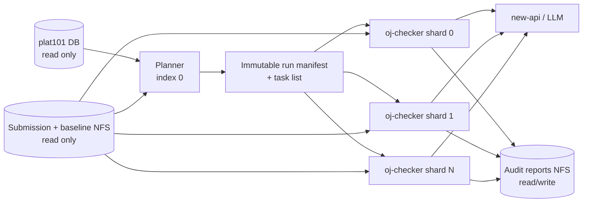

# Architecture Proposal

状态：Draft，等待确认测试 seam 后进入实现。

## 总体数据流



外部调用者只需要理解一个深模块：`AuditRunner.run(request) -> RunSummary`。快照一致性、双语料集、源码打包、baseline 差异、缓存、分片、重试和原子落盘都属于它的 implementation。

## 模块与 seam

### `AuditRunner`

外部 seam。CLI、Kubernetes Job 和本地测试通过同一个 interface 发起批次。

```python
run(request: AuditRequest) -> RunSummary
```

`AuditRequest` 只表达审查意图：模式、lab/owner/limit 过滤、cutoff、阈值、并发度和 dry-run。它不暴露 SQL、NFS 路径拼接或 LLM 请求细节。

### `SubmissionCatalog`

内部真实 seam，用于取得一致快照。

```python
snapshot(request: SnapshotRequest) -> SubmissionSnapshot
```

Adapters：

- `PostgresSubmissionCatalog`：生产只读事务。
- `InMemorySubmissionCatalog`：测试固定样例。

该 module 隐藏双语料集 SQL、run snapshot 选择和数据库类型转换。

### `SubmissionStore`

内部真实 seam，用于从 manifest 安全构建 source bundle。

```python
load_bundle(submission: SubmissionRef, policy: SourcePolicy) -> SourceBundle
```

Adapters：

- `NfsSubmissionStore`：生产 NFS。
- `FixtureSubmissionStore`：测试 fixture。

该 module 隐藏路径校验、多文件预算、baseline 定位、token 差异和编码错误处理。

### `SimilarityDetector`

算法 module，不为尚不存在的算法提前增加 adapter。它提供一个深 interface：

```python
detect(bundles: Iterable[SourceBundle], policy: SimilarityPolicy) -> CandidateSet
```

implementation 负责整份 digest、baseline-delta digest、MinHash/LSH、精确 Jaccard、同 lab 限制和候选去重。未来确实引入 AST 或其他算法时，再把该 seam 提升为可替换 adapter。

### `Reviewer`

内部真实 seam，每次只审一个稳定任务。

```python
review(task: AuditTask) -> ReviewResult
```

Adapters：

- `OpenAICompatibleReviewer`：new-api，支持 `content`/`reasoning_content`。
- `ReplayReviewer`：本地测试和历史结果重放。

prompt 构造、schema 校验、重试与速率限制都留在 module implementation 内，调用方不解析原始 HTTP JSON。

### `FileReportStore`

首版只有一个 filesystem implementation，根路径可指向 NFS 或测试临时目录，因此不引入额外 adapter seam。它负责内容寻址、原子写入、断点续跑和派生索引。

## Source bundle 策略

“最大文件”不是合法的审查策略。每个 source bundle 应包含：

- lab statement、required/allow、workflow 和 result 摘要。
- manifest 中所有相关的学生可修改源码。
- `compile.sh`、`run.sh`、`CMakeLists.txt`、配置文件等执行上下文。
- 每个文件相对 baseline 的真实 delta。
- 在总预算内为 delta 保留前后上下文。

相似指纹使用 delta token；LLM 裁决使用 delta 加有限上下文。这样既降低公共 baseline 噪声，也不会把“文件被修改”误称为“文件内容全是学生改动”。

NFS adapter 不使用字符串拼接后直接 `open()`：submission ID 必须是规范 UUID，manifest path 必须是无空段、`.`、`..`、反斜杠或 NUL 的相对 POSIX 路径；根目录、中间目录和最终文件逐级使用 `openat` + `O_NOFOLLOW`，并只接受普通文件。所有相关文件保留元数据，内容超过预算时显式标记截断原因。

## Indexed Job 执行模型

一个 CronJob 创建一个 `completionMode: Indexed` Job，建议初始 `completions: 4`、`parallelism: 4`：

1. completion index 0 在只读事务中生成快照、source metadata 和稳定排序的任务清单。
2. index 0 原子写入 `runs/<run_id>/manifest.json` 和 `_READY`。
3. 其他 Pod 等待 `_READY`，不参与规划。
4. 每个任务按稳定哈希分配到一个 completion index。
5. 每个 Pod 跳过已有且 cache key 匹配的结果，完成后写 `shards/<index>.done`。
6. index 0 等待全部 shard done，生成批次 summary 和派生索引。

这一设计不要求 Kubernetes API 写权限或外部消息队列。Pod 设置 `automountServiceAccountToken: false`。

所有 Pod 使用 required node affinity：

```yaml
requiredDuringSchedulingIgnoredDuringExecution:
  nodeSelectorTerms:
    - matchExpressions:
        - key: kubernetes.io/hostname
          operator: In
          values: [m601.clusters.zjusct.io]
```

m601 是 control-plane 节点但当前无 taint，因此必须设置 CPU/内存 requests 和 limits，并限制 LLM 并发。

## 数据库只读防线

当前 `oj-audit-db` 实际使用的 `plat101` 角色具备写权限，不能视为生产安全配置。

首版开发 Pod 同时使用：

- 连接参数：`default_transaction_read_only=on`。
- 批次事务：`BEGIN TRANSACTION ISOLATION LEVEL REPEATABLE READ READ ONLY`。
- 固定、参数化的 SELECT 查询。
- `statement_timeout`、`lock_timeout` 和 `idle_in_transaction_session_timeout`。

生产前必须创建 `oj_checker_ro` 角色，只授予所需表的 SELECT；代码级只读是第二道防线，不是数据库授权的替代品。

## NFS 状态布局

不使用一个并发修改的 `.index.json`。采用不可变、内容寻址的小文件：

```text
audit-reports/
  runs/<run_id>/
    manifest.json
    tasks/<task-key>.json
    results/<prefix>/<task-key>.json
    shards/<index>.done
    summary.json
  cache/review/<schema>/<prefix>/<cache-key>.json
  owners/<owner>/<lab>__<submission-prefix>__<score>.json
  plagiarism/<lab>/<pair-key>.json
```

manifest 冻结所选 submission 的 owner、score、提交时间、input manifest、active run state/result_info，并按内容哈希去重 lab definition，使 worker 无需重新查询 DB。写入流程是同目录临时文件、flush/fsync、原子 hard-link create-only；规划身份相同时复用原始 `generated_at`，不同内容不能覆盖已有 `run_id`。批次文件记录真实 Git commit、UTC cutoff、规则版本、prompt 版本、模型、阈值和 completion 数。

## 建议确认的测试 seam

TDD 只在以下 interface 上验证行为：

1. `SubmissionCatalog.snapshot`：最高分语料集与全部历史语料集不会混淆，快照 cutoff 和只读事务生效。
2. `SubmissionStore.load_bundle`：路径安全、多文件收集和真实 baseline delta；含 `.cu` 的提交不会再被打包成“无 GPU 代码”。
3. `SimilarityDetector.detect`：公共 baseline 不产生候选，非最高分相同 digest 会被发现，阈值和同 lab 限制有效。
4. `Reviewer.review`：结构化 schema、`reasoning_content` fallback、重试和 cache-key 版本失效。
5. `AuditRunner.run`：使用 in-memory/replay adapters 验证一个批次可断点续跑并生成 summary，不测试内部调用顺序。

确认后按以上顺序做垂直切片，而不是一次性写完所有测试。

## 部署阶段

1. `doctor` smoke test：m601 单 Pod，仅验证 DB 会话只读、NFS 可读、报告目录可写和 LLM 可达。
2. canary Indexed Job：一个 lab、少量任务、2 个 completion。
3. 重放昨日 429 个候选与已知非最高分 digest 案例。
4. 夜间 Indexed CronJob：`schedule: "30 23 * * *"`，`timeZone: Asia/Shanghai`。

## 当前实现边界

第一条垂直切片已实现 read-only snapshot、最高分单审任务、全部历史 exact-digest pair 和不可变 manifest。`--limit` 只限制单审任务，不裁剪抄袭语料。

公共 baseline digest 排除将在 `SubmissionStore.load_bundle` 切片中实现；在此之前 exact-digest 结果仍是候选信号，不能直接视为抄袭结论。MinHash、Reviewer 和生产 Indexed CronJob 也尚未实现。
